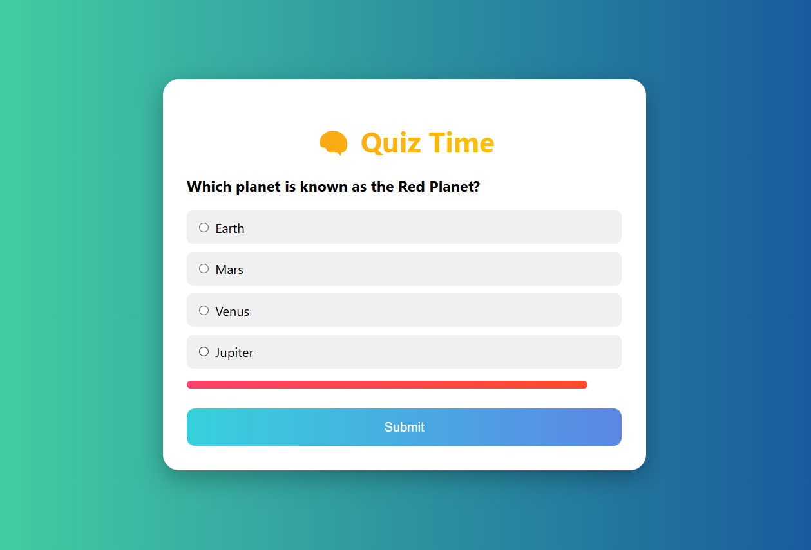
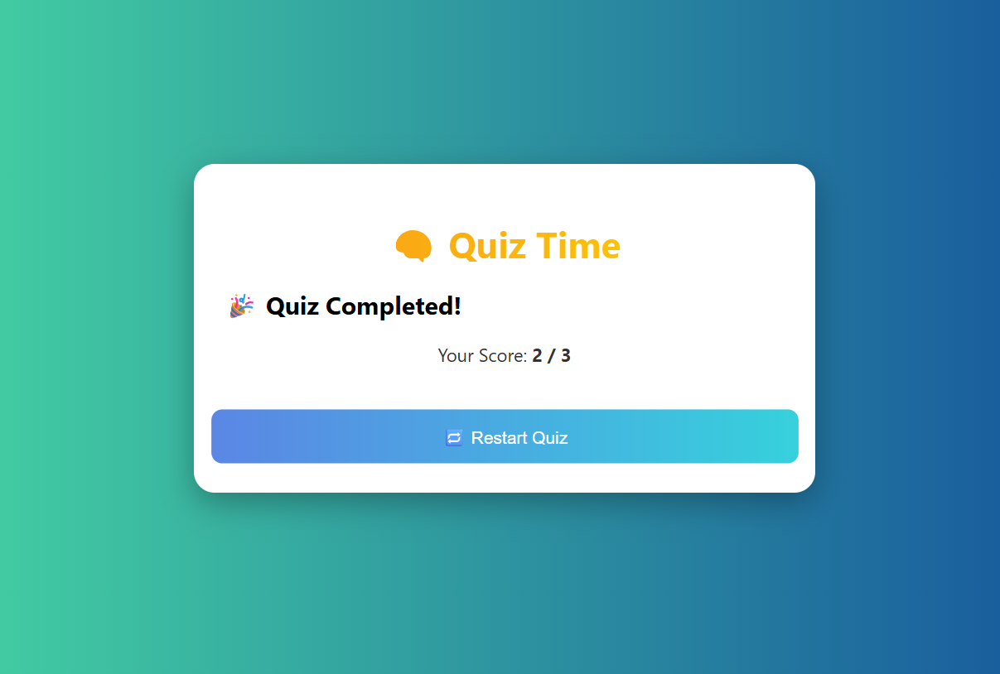

🎮 Advanced Quiz Game Web Application

This is a fully advanced, interactive, and animated quiz game built using only **HTML**, **CSS**, and **JavaScript** – no frameworks required! It supports single and multiple-choice questions as well as fill-in-the-blank answers.

🚀 Features

🖼️ Welcome Screen with modern design and transition animations
✅ Single-Select, Multi-Select, and Fill-in-the-Blank question types
⏱️ 20-second timer for each question with an animated progress bar
📊 Score calculation and result display
🎨 Fully responsive and colorful UI with gradient backgrounds
🔄 Restart Quiz functionality

 📁 How to Run

1. Download or clone this repository.
2. Open the `Quize.html` file in any modern web browser.
3. Play the quiz and enjoy!

 🧠 Technologies Used

HTML5 – For page structure
CSS3 – For styling and animations
Vanilla JavaScript – For quiz logic, scoring, and dynamic rendering

 ✍️ Question Types Supported

| Type         | Description                              |
|--------------|------------------------------------------|
| Single Select| Choose one correct option                |
| Multi Select | Choose multiple correct options          |
| Fill Blank   | Type the answer in a text input box      |

 🛠️ Future Enhancements (Optional Ideas)

 🎵 Add sound effects for answer submission
📱 Store high scores using `localStorage`
🗂️ Add categories or difficulty levels
🧪 Add explanations after each answer
🌐 Deploy using GitHub Pages or Netlify

💡 Sample Screenshot

> 
>  
>   

 👨‍💻 Author

Nireekshith B R

 GitHub: [your-github-profile](https://github.com/Nireekshith25e)

 📜 License

This project is open-source and free to use under the MIT License.
